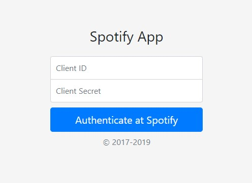
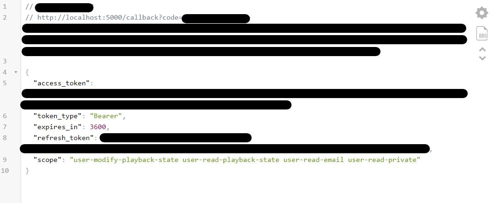
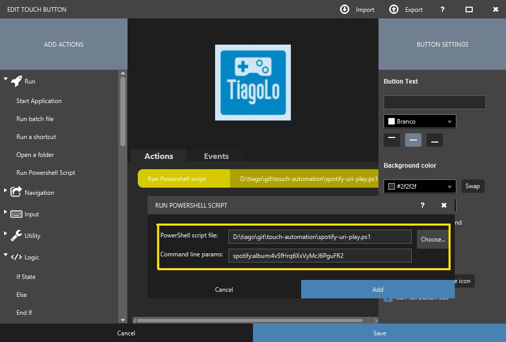

# Touch Automation
Collection of powershell script for using as buttons for touch-portal app: https://www.touch-portal.com/

## TL; DR;
* Read the 2 blog post by [@bmsimons], about spotify authentication:
  * https://bartsimons.me/net-core-and-the-spotify-api-getting-authenticated/ (required);
  * https://bartsimons.me/ps-spotify-a-powershell-module-to-control-the-spotify-web-api/ (optional);
* I have made little modifications to [@bmsimons] codes, so there is no need to hardcode any token, ID or secret;
* Clone this git repository with git submodules using:
    ```
    git clone --recurse-submodules https://github.com/tiagolo/touch-automation.git
    cd touch-automation
    git submodule foreach 'git checkout master'
    ```
* Enter the `touch-automation` folder;
* Run the .Net Core webapp for authentication with spotify:
    ```
    dotnet run --project dotnet-core-spotify-authentication
    ```
    * This authentication is better explained by [@bmsimons] in this [blog post];
    * DotNet Core v2.2 is Required - https://dotnet.microsoft.com/download;
* Launch any modern browser like [Google Chrome] or [Firefox] at the URL: http://localhost:5000
* Enter the clientID and clientSecret for your Spotify app in the authentication form:
  
  * The Spotify app creation is explained by [@bmsimons] in this [blog post]
* If the authentication succeeded, spotify will return an authentication_token and a refresh token, in a JSON similar to this:
  
* All keys and tokens are stored in your user environment variables in Windows, there is no need for coping this data;
* The DotNet app can be closed now, by pressing `Ctrl+C`;
* Test the main script by running:
    ```powershell
    powershell -File spotify-uri-play.ps1
    ```
    * This should open and play this playlist: - [spotify:playlist:37i9dQZEVXbMDoHDwVN2tF](spotify:playlist:37i9dQZEVXbMDoHDwVN2tF) | [Top 50 Global](https://open.spotify.com/playlist/37i9dQZEVXbMDoHDwVN2tF?si=lbUUvr0UQiiqpM2lmD4ANg)
* To open any other music, album or playlist just add the spotify URI as a parameter for the script:
    ```powershell
    powershell -File spotify-uri-play.ps1 spotify:album:4vSfHrq6XxVyMcJ6PguFR2
    ```
* For using the spotify script with [Touch Portal], just use the powershell script action and pass the Spotify URI as Command line params:
  

## Know-Issues
* Some times when spotify is closed it has problems identifing the default device and does not autoplay the URI, if the play media button or spacebar is pressed then it starts.

[@bmsimons]: https://github.com/bmsimons
[blog post]: https://bartsimons.me/net-core-and-the-spotify-api-getting-authenticated/
[Google Chrome]: https://www.google.com/chrome/
[Firefox]: https://www.mozilla.org/firefox/
[Touch Portal]: https://www.touch-portal.com/